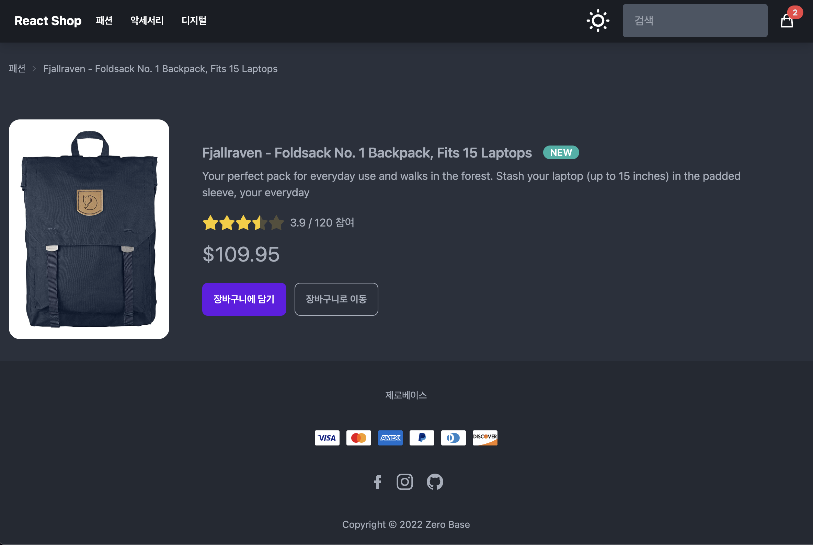

<h1> React Shop </h1>

 React를 이용한 쇼핑몰입니다. 

<h3> Description of Project </h3>
<h3> 사이트 도메인 </h3>
<a href="https://react-shop-9jrt.vercel.app/" target="_blank">react-shop-9jrt.vercel.app</a>

 

<h2><b> Preview </b></h2> 
<h3><b> 메인 페이지 </b></h3>

   
<h3><b> 상품 페이지 </b></h3>

   
<h3><b> 상품 상세페이지 </b></h3>

   
<h3><b> 장바구니 페이지 </b></h3>

### Tech Stacks

